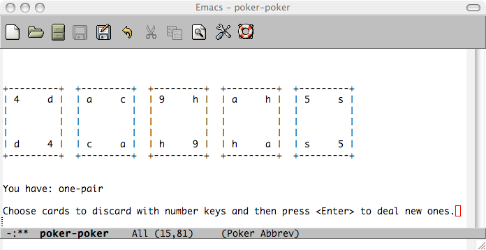

Emacs Poker
===========

In the spring of 2006, I had been reading a bit about Lisp and decided that I
should try to write something semi-interesting to cement my knowledge. So I
fired up Emacs and started messing around and this is what came out of it.

It's a simple video poker game like the kind that you play in Vegas or in the
kind of place that offers skeeball. It doesn't take bets or keep any kind of
running score and there's no support for wild cards, but I figured I'd see if
more than 3 people download it before I started adding more features.
